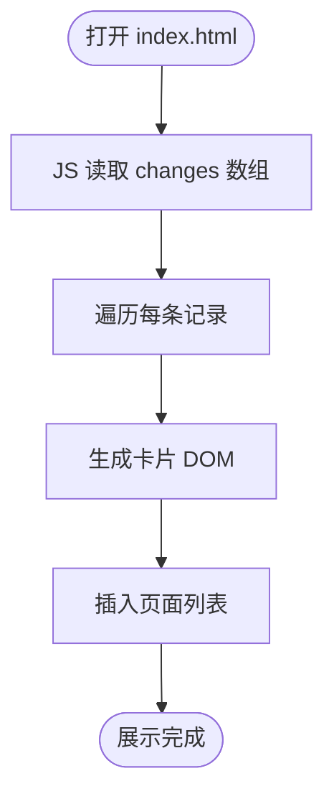

# AI变更记录-HTML展示页 开发文档

> 日期：2026-06-08
> 任务类型：新功能
> 复杂度：中等
> 状态：草稿
> 关联分支/路径：main
> 关联版本：3cc0dbb

---

## 一、需求说明

### 背景
md 文档对人类阅读不友好，项目中 AI 生成的技术方案、需求文档、bug 修复、设计记录等散落在 `docs/` 目录下，缺乏统一的可视化入口。需要一个可以直接在浏览器打开的 HTML 页面，集中展示所有变更记录。

### 目标
- [ ] 在 `./project-html/` 目录下创建 HTML/CSS/JS 展示页（首次执行时创建）
- [ ] 页面以卡片/列表形式展示所有 AI 变更记录（技术方案、需求文档、bug 修复、设计等）
- [ ] 数据写死在 HTML 文件中，每次执行 yan-dev-doc skill 后手动追加新条目
- [ ] 页面简洁，信息密度合理，方便快速浏览和定位

### 范围
- ✅ 包含：`project-html/index.html`、内联 CSS、内联 JS、静态数据
- ❌ 不包含：后端服务、自动读取 md 文件、搜索功能、用户登录

---

## 二、技术方案

### 方案概述
单文件静态 HTML，数据以 JS 数组形式内联，页面渲染时动态生成条目列表。

### 核心设计

**数据结构**（JS 数组，每条记录对应一次 AI 变更）：
```js
const changes = [
  {
    title: "AI变更记录-HTML展示页",
    date: "2026-06-08",
    type: "新功能",        // 新功能 / Bug修复 / 重构 / 性能优化 / 设计
    complexity: "中等",    // 简单 / 中等 / 复杂
    status: "草稿",        // 草稿 / 进行中 / 已完成
    branch: "main",
    summary: "解决 md 文档查看困难，生成可视化 HTML 展示页"
  }
];
```

**渲染方式**：JS 遍历数组，用 `innerHTML` 生成卡片列表，无框架依赖。

**展示字段**：标题、日期、类型（带颜色标签）、复杂度、状态、摘要。

### 最小影响分析（开闭原则）
- **新增内容**：`project-html/index.html`（全新文件）
- **不变内容**：`skills/`、`docs/`、`install.sh`、`install.ps1` 均不修改
- **必须修改**：无——每次追加记录只需在 HTML 的 `changes` 数组末尾新增一个对象

---

## 三、代码变更清单

| 文件路径 | 变更类型 | 说明 |
|----------|----------|------|
| `project-html/index.html` | 新增 | 单文件 HTML，含内联 CSS + JS + 静态数据数组 |

---

## 四、流程图



---

## 五、测试要点

### 手动验证
- [ ] 浏览器直接打开 `project-html/index.html`，无需启动服务
- [ ] 页面正常渲染，所有字段显示正确
- [ ] 追加一条新记录到 `changes` 数组后刷新，新卡片出现

### 边界
- [ ] `changes` 数组为空时页面有友好提示
- [ ] 摘要文字过长时不破坏卡片布局

---

## 六、风险与注意事项

| 风险点 | 影响等级 | 应对措施 |
|--------|----------|----------|
| 手动维护数据容易漏更新 | 低 | yan-dev-doc 完成后立即追加，作为 Next Steps 的一步 |
| 数据量增大后页面性能 | 低 | 纯静态渲染，百条以内无性能问题 |

---

## 七、上线计划

- **依赖项**：无，纯前端静态文件
- **回滚方案**：删除 `project-html/` 目录即可完全回退

---

## 八、实现 Todo

- [ ] 创建 `project-html/` 目录
- [ ] 编写 `index.html`：HTML 骨架 + 内联 CSS（简洁卡片布局）
- [ ] 编写 JS 数据数组（含首条示例记录：本次任务）
- [ ] 编写 JS 渲染函数，遍历数组生成卡片
- [ ] 浏览器验证页面正常显示
- [ ] 后续每次运行 yan-dev-doc 后，手动向 `changes` 数组追加新记录

---

## 九、代码评审关注点

- **重点检查**：JS 渲染函数是否有 XSS 风险（数据写死无用户输入，可用 innerHTML）
- **回归风险**：无，全新文件不影响任何现有功能
- **不要改的**：`skills/`、`docs/` 目录结构不应被本次任务涉及
