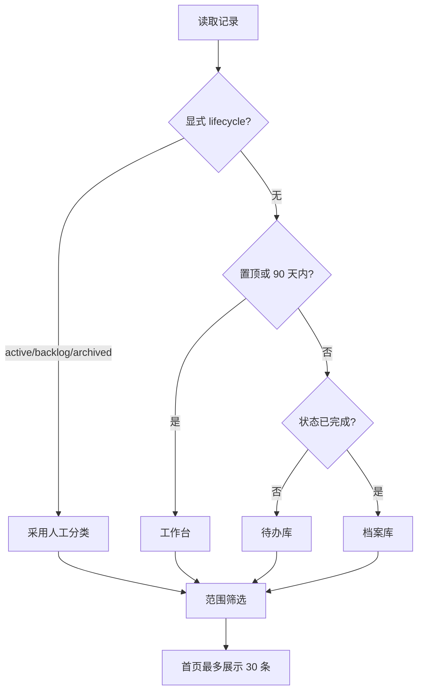

# 看板分层与归档治理开发文档

> 日期：2026-07-18
> 任务类型：重构 / 性能优化
> 复杂度：中等
> 状态：草稿
> 关联分支/路径：Git: main
> 关联版本：6f1ef0f
> 前置文档：无
> 文档模式：Standard

---

## 一、需求说明

### 背景

当前看板已经支持服务/模块分组、搜索、类型筛选和状态筛选，但所有记录仍保存在一个 `changes.js` 中，首页会把当前筛选范围内的全部服务、模块和条目一次性渲染出来。随着开发文档、Bug、代码阅读和业务流持续积累，首页阅读噪音和 DOM 数量会不断增长。

构建脚本还会为每条记录生成一个内嵌 CSS、渲染逻辑和约 3.34 MB Mermaid 运行库的自包含页面。条目数增长时，生成目录体积和全量重建时间都会近似线性增长。

### 目标

- [ ] 将看板划分为工作台、待办库和档案库，默认聚焦近期或置顶工作。
- [ ] 将首页默认条目数量控制在固定上限，历史记录仍可筛选和检索。
- [ ] 把常规详情页改为共享静态资源并增量写入，避免 Mermaid 运行库按条目重复存储。
- [ ] 保留按需导出单个自包含 HTML 的能力，并保持现有 `pages/<slug>.html` 链接可用。

### 范围

- ✅ 包含：看板筛选与首页渲染、生命周期字段、写入助手字段保留、构建脚本、模板副本、相关使用文档与本地检查。
- ❌ 不包含：服务端搜索、数据库、远程部署、历史 `changes.js` 数据分片、自动修改团队共享状态。

### 判断依据、明确假设与待确认

| 类型 | 内容 | 依据 | 处理口径 |
|------|------|------|----------|
| 事实 | 首页当前对筛选后的全部分组生成表格 | `project-html/js/board.js:423-520` | 必须改为有上限的当前范围列表 |
| 事实 | 每次构建会清空并重建全部页面 | `project-html/build.js:63-109` | 改为内容未变不写、仅清理孤儿页 |
| 事实 | Mermaid 本地文件约 3.34 MB，当前会内嵌到每个页面 | `project-html/build.js:54-103`、`project-html/js/vendor/mermaid.min.js` | 常规详情页改为共享资源，单文件导出改为显式命令 |
| 假设 | 90 天适合作为默认近期窗口 | 用户已接受上一轮建议 | 提供常量和显式 `lifecycle` 覆盖，后续可调整 |
| 假设 | 当前数据量无需立即物理分片 | 当前真实看板仅 1 条记录 | 先解决阅读和重复资源问题，达到阈值后再按年分片 |

---

## 二、技术方案

### 方案概述

在浏览器端基于 `updatedAt/date`、状态、`pinned` 和显式 `lifecycle` 将记录划分为工作台、待办库、档案库；默认只展示工作台。首页保留摘要、角色入口和最近更新，但详细清单改为固定批量的扁平列表，用户点击“加载更多”时再扩容。

构建端继续生成原路径 `pages/<slug>.html`，但页面改为引用看板共享的 CSS、JS 和 Mermaid 文件。新增 `node project-html/build.js --standalone <docPath|slug>`，仅在需要外发时生成一个真正自包含的 `exports/<slug>.html`。

### 核心设计

- `lifecycle` 为可选人工覆盖字段；`active`、`backlog`、`archived` 分别强制进入工作台、待办库、档案库。
- 没有显式生命周期时：置顶或 90 天内进入工作台；超过 90 天且未完成进入待办库；超过 90 天且已完成进入档案库。日期缺失或非法时保守留在工作台，避免记录被静默隐藏。
- `board-add.js` 更新既有条目时保留 `status/lifecycle/pinned`，并维护 `updatedAt`，避免重新生成文档覆盖人工治理字段。
- 常规构建只在目标 HTML 内容变化时写文件，并只删除不再对应任何记录的孤儿页；索引路径和 slug 去重规则保持不变。

### AI 执行口径

- **前置条件**：保持根目录 `project-html/` 与 `skills/yan-dev-doc/assets/board/` 外壳字节一致；行为变化必须提升 `BOARD_VERSION`。
- **执行顺序**：先修改根目录看板逻辑和构建脚本，再同步模板副本，然后更新 skill/README/AGENTS 说明，最后运行完整检查。
- **验收标准**：默认范围为工作台；首页详细清单默认最多 30 条；历史范围可切换；常规详情页不内嵌 Mermaid；显式导出仍生成自包含文件；所有检查通过。
- **禁止改动**：不改变 `docPath` 去重键、`slugOf/buildSlugMap` 一致性、源文档路径、数据记录内容和首次归档的只复制策略。

### 最小影响分析（开闭原则）

- **新增内容**：生命周期分类函数、范围筛选控件、首页加载更多、按需自包含导出分支。
- **不变内容**：详情渲染、接口索引、Mermaid 降级、状态 localStorage 覆盖、文档总索引结构。
- **必须修改**：`board.js/index.html/css` 承担现有单页应用渲染，无法通过外部插件扩展；`build.js` 是页面生成唯一入口，必须调整输出策略；`board-add.js` 必须保护新增治理字段。

---

## 六、代码变更清单

| 文件路径 | 变更类型 | 说明 |
|----------|----------|------|
| `project-html/js/board.js` | 修改 | 增加生命周期分类、范围筛选和有界首页列表，并兼容详情页资源路径 |
| `project-html/index.html` | 修改 | 增加工作台、待办库、档案库和全部范围入口 |
| `project-html/css/board.css` | 修改 | 增加范围导航与加载更多的布局样式 |
| `project-html/build.js` | 修改 | 生成共享资源详情页、增量写入，并增加显式自包含导出 |
| `project-html/board-add.js` | 修改 | 保留治理字段并维护更新时间 |
| `skills/yan-dev-doc/assets/board/*` | 修改 | 同步上述看板外壳模板，供安装后的各 skill 使用 |
| `skills/yan-dev-doc/SKILL.md`、`reference.md` | 修改 | 更新构建和导出行为说明 |
| `skills/bug-fix/SKILL.md`、`skills/biz-flow/SKILL.md`、`skills/code-reading/SKILL.md` | 修改 | 更新复用看板的页面产物说明 |
| `AGENTS.md`、`README.md` | 修改 | 更新仓库架构和使用方式 |

---

## 七、流程图

---

## 八、测试要点

### 验收标准

- [ ] 新旧字段均能正确分类，非法日期不会导致记录消失。
- [ ] 搜索、类型筛选、仅未完成和范围筛选可以组合使用。
- [ ] 首页默认详细清单不超过 30 条，加载更多后继续显示。
- [ ] `pages/` 常规页面引用共享资源，单页体积不再包含 Mermaid 大文件。
- [ ] `--standalone` 可按 `docPath` 或 slug 导出单个完整 HTML。
- [ ] 根目录外壳和模板外壳字节一致。

### 静态与回归检查

- [ ] `node scripts/check-board-sync.js`（TestDependencyClass: Hermetic）
- [ ] `node scripts/check-all.js`（TestDependencyClass: Hermetic）
- [ ] 对生成页面做文件大小、资源引用和自包含导出断言（TestDependencyClass: Hermetic）

---

## 九、风险与注意事项

| 风险点 | 影响等级 | 应对措施 |
|--------|----------|----------|
| localStorage 状态只对当前浏览器可见 | 中 | 自动分类可使用有效状态，但团队共享归档仍以源数据和显式 lifecycle 为准 |
| 共享资源详情页不能脱离目录单独发送 | 中 | 提供显式 `--standalone` 导出，不再默认复制 3.34 MB 运行库 |
| 老项目升级外壳后字段缺失 | 低 | 所有新字段可选，缺失时按日期和状态推导 |
| 一次修改多个镜像文件产生漂移 | 中 | 运行 `check-board-sync.js` 做字节一致性检查 |

---

## 十、上线计划

- **依赖项**：Node.js；无新增第三方依赖。
- **回滚方案**：恢复 v21 外壳与旧构建脚本；`data/changes.js` 新增字段可被旧版忽略，不需要数据回滚。

---

## 十一、实现 Todo

- [x] 在 `project-html/js/board.js` 与 `index.html/css` 实现三层范围、组合筛选和有界首页列表。
- [x] 在 `project-html/board-add.js` 保留 `status/lifecycle/pinned` 并维护 `updatedAt`。
- [x] 在 `project-html/build.js` 实现共享资源详情页、内容增量写入和显式自包含导出。
- [x] 将所有外壳变更同步到 `skills/yan-dev-doc/assets/board/` 并提升 `BOARD_VERSION`。
- [x] 更新相关 skill、README 和 AGENTS 说明，避免继续宣称默认页面为自包含文件。
- [x] 运行目标断言、`node scripts/check-board-sync.js` 和 `node scripts/check-all.js`，记录真实结果。

---

## 十二、代码评审关注点

- **重点检查**：生命周期边界、日期计算、筛选组合、slug/路径兼容、构建脚本孤儿页清理和导出选择器。
- **回归风险**：详情页内的源文档/API 相对路径、同名 slug 去重、首次历史归档和数据覆盖哨兵。
- **不要改的**：`data/changes.js` 现有记录、`docPath` 去重语义、数据库与业务接口。

---

## 十三、实施结果回填

### Todo 对照

| 项目 | 结果 | 证据 |
|------|------|------|
| 三层范围与有界渲染 | 已完成 | `scripts/check-board-behavior.js` 验证生命周期分类、首页 30 条上限、侧边模块 20 条上限和加载更多 |
| 治理字段保护 | 已完成 | 行为检查用两次相同 `docPath` 写入验证 `status/lifecycle/pinned/updatedAt` |
| 轻量详情页 | 已完成 | 两个常规页面分别约 4.6 KB、5.7 KB，均引用共享 Mermaid/JS/CSS；Mermaid vendor 为 3,339,532 bytes |
| 按需自包含导出 | 已完成 | `node project-html/build.js --standalone "docs/2026-07-18/看板分层与归档治理.md"` 成功生成约 3.43 MB 单文件 |
| 增量构建 | 已完成 | 连续运行 `node project-html/build.js` 回显 `写入 0，清理孤儿 0` |
| 模板与文档同步 | 已完成 | `node scripts/check-board-sync.js`、`node scripts/check-agent-doc-sync.js`、`node scripts/check-docs.js` 通过 |

### 实际变更文件

- 看板运行时：`project-html/index.html`、`css/board.css`、`js/board.js`、`build.js`、`board-add.js`、`data/changes.js`。
- 安装模板：`skills/yan-dev-doc/assets/board/` 对应外壳文件。
- 工作流说明：`skills/yan-dev-doc/`、`skills/bug-fix/SKILL.md`、`skills/biz-flow/SKILL.md`、`skills/code-reading/SKILL.md`。
- 仓库说明与检查：`AGENTS.md`、`CLAUDE.md`、`README.md`、`.gitignore`、`scripts/check-board-behavior.js`、`scripts/check-all.js`。

### 验证结果

- `node scripts/check-board-behavior.js`：通过，TestDependencyClass `Hermetic`。
- `node scripts/check-all.js`：通过，包含 12 个脚本检查、看板同步、文档/metadata/Workflow Brief/installers/evals、构建和 `git diff --check`；TestDependencyClass `Hermetic`。

### 偏离项

- 未实施 `changes.js` 按年份物理分片。当前只有 2 条真实记录，按照方案在约 500 条或 2 MB 阈值后再评估，避免现阶段引入动态脚本分片复杂度。
