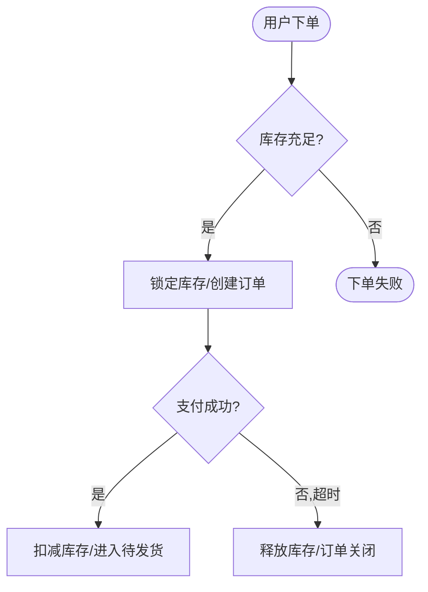
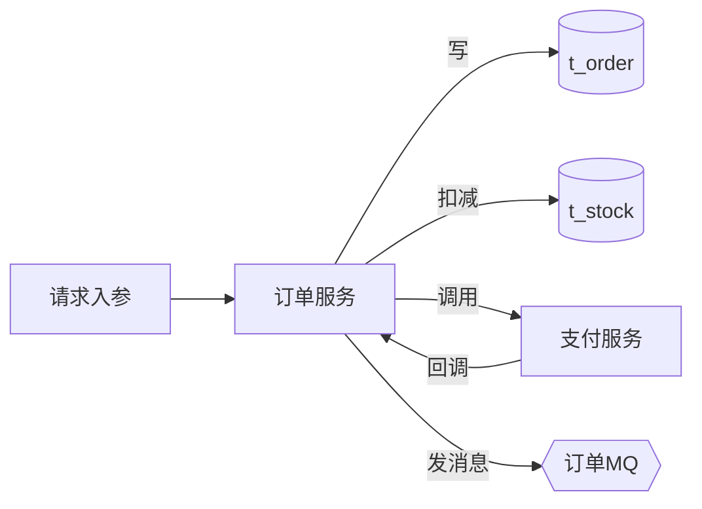
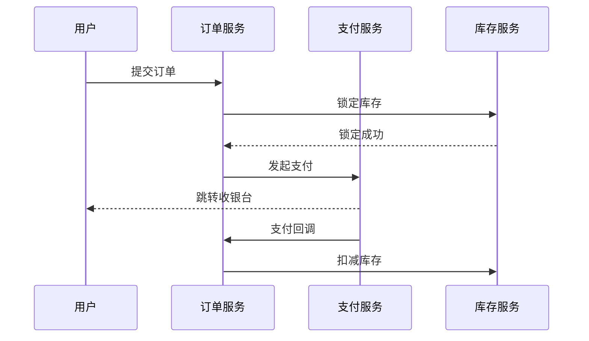
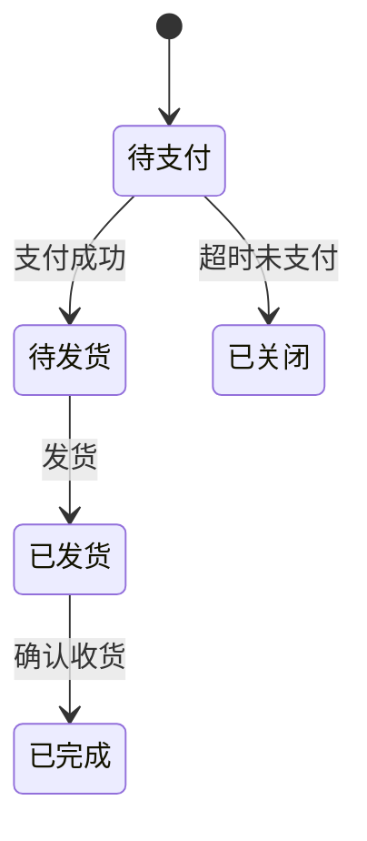

# biz-flow Reference

> SKILL.md 的详细规范——问题集、文档模板、HTML 追加格式、输出格式。
> 在 Step 2-6 按需加载，不在 SKILL.md 启动时注入。

---

## Step 2 问题集

**使用方式：这是查漏清单，不是逐条必问题卷。拿到至少一个接口/Controller/任务入口后，优先从代码、Swagger、字典、现有文档里补齐触发场景、数据对象、状态流转和规则。只问会影响业务语义、权限范围、接口先后关系、数据归属或测试范围的阻塞项；确需询问时每次只问一个。**

1. **相关接口有哪些？**（核心）请贴出本次要梳理的接口：URL + 方法 + 一句话作用即可；也可以给 Controller 类名/方法、Swagger / Apifox 片段。多个接口请一并列出，并说明它们的先后或依赖关系。
2. 这条业务的**触发场景**是什么？谁、在什么操作下触发？是同步调用还是异步（定时任务 / MQ / 回调）？
3. 涉及哪些**数据**？读写了哪些表 / 缓存 / 外部服务？有没有关键的状态字段（如订单状态、审批状态）？
4. 有哪些**业务规则 / 分支**？什么条件走什么流程（金额阈值、用户类型、库存是否充足、超时…）？异常或失败时怎么处理（回滚 / 补偿 / 重试）？
5. 这条业务归属哪个**微服务/模块**？格式 `服务/模块`（如 `订单服务/履约`；单体项目填 `项目名/模块名`；不确定填 `通用/通用`）。

> 用户答"不知道"/"待定" → 记 `待补充`，不要继续追问同类非阻塞细节。第 1 问拿不到任何接口或入口 → 提示用户至少给一个入口再继续。

---

## 文档模板

````markdown
# $feature 业务逻辑梳理（面向测试）

> 日期：<YYYY-MM-DD>
> 归属：<服务/模块>
> 关联分支：<branch>
> 读者：测试 / 产品 —— 看懂业务怎么走、数据去哪、该测什么

---

## 一、业务概述

[3–5 句，测试视角：这条业务整体在做什么、从哪触发、中间经过哪些关键环节、最终达成什么结果。有核心状态流转的点一句。]

### 测试执行口径

- **主流程**：[测试应该先跑通的 happy path，按接口/操作顺序写]
- **优先异常**：[最容易出问题、最该优先覆盖的失败/边界/并发场景]
- **数据核对**：[测完后必须核对的表、字段、消息、日志或外部状态]
- **暂不覆盖**：[本次梳理明确不覆盖的业务分支，避免测试范围发散]

---

## 二、角色与入口

| 角色/触发方 | 入口/操作 | 业务职责 | 测试关注 |
|-------------|-----------|----------|----------|
| [如 App 现场人员] | [接口/按钮/任务] | [做什么] | [权限、按钮显隐、入口参数] |

> 需要区分 App / PC / 后台任务 / MQ / 第三方回调时必须写本节；只有单一入口且无权限差异时可简化。

---

## 三、上下文与前置条件

| 上下文字段/条件 | 来源 | 业务用途 | 说明 |
|-----------------|------|----------|------|
| [如 companyId / 当前仓库 / 字典值] | [token/Redis/配置/数据库] | [校验或写入位置] | [缺失时行为] |

> 写清登录上下文、租户/公司/仓库/部门、权限、字典、配置、缓存等信息。测试要能据此准备数据。

---

## 四、涉及接口

| Method | URL | 作用 | 触发时机 |
|--------|-----|------|----------|
| POST | /api/v1/xxx | | |

> 按依赖/先后顺序排列；异步触发（定时/MQ/回调）在"触发时机"标注。

---

## 五、业务流转图

> 业务状态怎么流转、什么条件走什么分支。**这是测试设计用例的主线。**



**说明：** [这张图在讲什么；测试重点看哪几个分支/判断点。]

---

## 六、数据流图

> 数据从入口经过哪些服务/表，最终落到哪。涉及多表/多服务时画，否则删除本节。



**说明：** [关键数据在哪写、哪读；测试要核对哪张表/哪个字段的最终值。]

---

## 七、时序图

> 多个服务/接口之间的调用时序。跨服务或有回调时画，否则删除本节。



**说明：** [测试关注哪一步可能超时/失败、回调没来怎么办。]

---

## 八、状态流转

> 有明确状态字段流转时画，否则删除本节。



---

## 九、阶段数据变动

> 按业务阶段写清数据怎么变。涉及写表、状态更新、消息、缓存、外部调用时必须写；纯只读查询可简化为「无写入，仅查询」。

### 9.1 [阶段名，如 申请 / 审核通过 / 驳回 / 回调]

触发：[接口/按钮/任务/回调]

摘要：[这一阶段整体做什么，事务或回滚边界是什么。]

| 数据对象/表 | 操作 | 关键字段/变化 | 测试核对点 |
|-------------|------|---------------|------------|
| [table/object] | INSERT/UPDATE/SELECT/DELETE/MQ | [字段从 A 到 B，或写入来源] | [测完查什么、期望是什么] |

---

## 十、关键业务规则

| 规则 | 触发条件 → 系统行为 → 边界 |
|------|---------------------------|
| [规则名] | [什么条件下，系统怎么做，边界/上限是什么] |

---

## 十一、校验规则

| 阶段 | 校验项 | 失败提示/行为 | 测试核对点 |
|------|--------|---------------|------------|
| [申请] | [字段非空/权限/状态/归属] | [返回错误/回滚/跳过] | [如何构造数据验证] |

---

## 十二、测试关注点

> 每条是一个具体、可验证的点，覆盖正常 / 异常 / 边界 / 并发。
> 写法要求：动作 + 输入/条件 + 预期结果 + 核对点；不要只写"测试异常场景"。

### 正常流程
- [ ] [主流程走通，核对最终状态与数据]

### 异常与边界
- [ ] 入参为 null / 空 / 超长 / 非法值
- [ ] 库存为 0 / 余额不足 / 临界值（如金额刚好等于阈值）
- [ ] 支付超时、回调丢失、第三方返回失败

### 并发与幂等
- [ ] 重复提交 / 重复回调（幂等是否生效）
- [ ] 并发抢同一份库存

### 数据核对
- [ ] [测完后该核对哪张表/哪个字段/哪条消息]

---

## 十三、涉及数据对象

| 对象/表 | 阶段 | 操作 | 关键字段/说明 |
|---------|------|------|---------------|
| [table/cache/topic/service] | [申请/审核/查询] | [SELECT/INSERT/UPDATE/MQ/CALL] | [关键字段、状态值、外部影响] |
````

---

## HTML 追加格式

`data/changes.js` 文档标记行上方插入（非空字段才写，没有的图字段省略）：

```js
  {
    kind: "biz",
    service: "<service>",
    module: "<module>",
    title: "<title>",
    type: "业务流",
    status: "已完成",
    date: "<date>",
    branch: "<branch>",
    docPath: "<docPath>",
    background: "<业务概述，可 \\n 分段>",
    roles: [
      { name: "<角色名>", channel: "<App/PC/任务/回调>", entry: "<接口或操作>", desc: "<职责与权限范围>" }
    ],
    context: [
      { field: "<上下文字段/条件>", source: "<来源>", usage: "<业务用途>", note: "<缺失或边界说明>" }
    ],
    apis: [{ method: "POST", url: "/api/v1/xxx", desc: "<作用>" }],
    bizFlow: `flowchart TD
  A([开始]) --> B{判断}
  B -->|是| C[处理]`,
    dataFlow: `flowchart LR
  IN[入参] --> SVC[服务] --> T[(表)]`,
    sequence: `sequenceDiagram
  participant U as 用户
  U->>O: 请求`,
    stateMachine: `stateDiagram-v2
  [*] --> 待支付`,
    dataChanges: [
      { stage: "<阶段名>", trigger: "<触发入口>", summary: "<阶段摘要>",
        operations: [
          { target: "<表/对象>", action: "INSERT/UPDATE/SELECT/MQ/CALL", fields: "<关键字段变化>", check: "<测试核对点>" }
        ] }
    ],
    bizRules: [
      { title: "<规则名>", desc: "<触发条件→行为→边界>" }
    ],
    validations: [
      { stage: "<阶段>", rule: "<校验项>", failure: "<失败提示/行为>", check: "<测试核对点>" }
    ],
    testPoints: [
      "<具体可验证的测试点 1>",
      "<具体可验证的测试点 2>"
    ],
    dataObjects: [
      { name: "<表/缓存/消息/外部服务>", phase: "<阶段>", action: "<操作>", note: "<关键字段/说明>" }
    ]
  },
  // ─── 在此行上方追加新记录 ───
```

> 没有数据流图 / 时序图 / 状态机时，直接省略对应字段（`dataFlow` / `sequence` / `stateMachine`），看板会自动不渲染该节。角色、上下文、阶段数据变动、校验规则、涉及数据对象能确定时优先写结构化字段；确实不存在时可省略。

---

## 完成后输出格式

```
✅ 业务流方案已生成：docs/biz-flow/<日期>/<业务名>.md
🔀 已登记到 HTML 看板（浏览器打开 project-html/index.html，筛选「🔀 业务流」查看）
📤 单页已生成：project-html/pages/<slug>.html —— 可直接发给测试/产品
📑 文档总索引已更新：docs/INDEX.md

给测试的一句话摘要：
<这条业务怎么走 + 最该测的 2-3 个点>

如需深入代码层面的调用链（给开发看），运行：/code-reading <入口类#方法>
```
