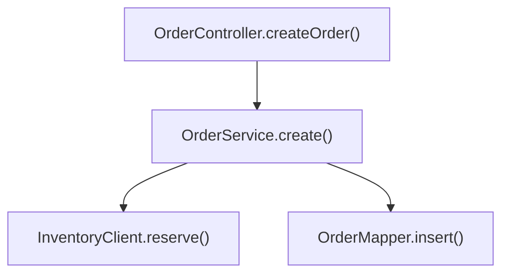

# code-reading Examples

以下示例只校准模式、证据表达和产物边界。类名与路径是虚构的格式示例；实际运行必须回到当前仓库读取证据。只读取与当前模式对应的一节。

## 示例 1：CodeMap 代码地图片段

用户调用：

```text
使用 code-reading skill 从 OrderController#createOrder 生成代码地图并登记看板
```

模式判定：`CodeMap` + 入口代码模式。输出片段：

````markdown
# 创建订单 代码地图

> 入口：`OrderController.createOrder()`
> 入口模式：入口代码

## 一、概览

**功能描述：** 接收创建订单请求，完成库存预占后持久化订单。

**入口选择依据：** 用户明确提供 `OrderController#createOrder`；在 `order-web/src/main/java/com/acme/order/OrderController.java:42` 找到唯一同名方法。

## 二、入口与调用链



## 四、主要代码位置

| 类/方法 | 文件路径:行号 | 说明 |
|---------|---------------|------|
| `OrderController.createOrder()` | `order-web/src/main/java/com/acme/order/OrderController.java:42` | HTTP 入口与参数校验 |
| `OrderService.create()` | `order-service/src/main/java/com/acme/order/OrderService.java:87` | 编排库存预占和订单落库 |
| `InventoryClient.reserve()` | `order-client/src/main/java/com/acme/order/InventoryClient.java:31` | 调用库存服务 |

## 七、假设与待确认

| 类型 | 内容 | 依据 | 后续处理 |
|------|------|------|----------|
| 非阻塞待确认 | 库存服务超时后的补偿由异步任务完成，当前入口未直接调用 | `OrderService.java:103` 只记录补偿事件 | 人工 Review 时结合消费者链路继续阅读，不在代码地图中判定缺陷 |
````

完成后会生成 `docs/code-reading/<日期>/创建订单.md`、reading 看板条目和轻量详情页，并输出 Understanding Gate 的 Workflow Brief。它只描述结构与观察，不输出 finding、修复建议或“已通过审查”。

## 示例 2：ImpactAnalysis 只读影响分析

用户调用：

```text
对比 contracts/order-v2.openapi.yaml 与现有创建订单调用链，只判断新增必填 warehouseCode 会影响谁；不要写文件
```

模式判定：`ImpactAnalysis`。输出片段：

```markdown
AnalysisMode: ImpactAnalysis
WritePolicy: NoWorkspaceWrites

# 创建订单 warehouseCode 只读影响分析

## 结论

`POST /api/orders` 的 method/path 和响应不变，但请求新增必填 `warehouseCode`。现有 PC 入口已传该字段；批量导入适配层未传，属于明确受影响。该结论是兼容性影响，不定性为 Bug。

## 契约对比

| 维度 | 新契约证据 | 现有实现证据 | 影响判断 |
|------|------------|--------------|----------|
| method/path | `contracts/order-v2.openapi.yaml:18` | `OrderController.java:40` | 证据显示不受影响 |
| 请求字段与约束 | `warehouseCode` required，`:31` | `ImportOrderAdapter.java:76` 未赋值 | 明确受影响 |
| 响应结构 | schema 未变化，`:52` | `CreateOrderResponse.java:12` | 证据显示不受影响 |

## 现有调用链

`ImportOrderJob.execute()` -> `ImportOrderAdapter.toRequest()` -> `OrderClient.createOrder()`

## 影响清单

| 对象 | 影响级别 | 原因 | 证据 | 后续动作 |
|------|----------|------|------|----------|
| 批量导入适配层 | 明确受影响 | 未构造新增必填字段 | `ImportOrderAdapter.java:76` | 进入 dev-doc 明确字段来源 |
| PC 下单入口 | 证据显示不受影响 | 已从登录上下文填充仓库编码 | `PcOrderFacade.java:58` | 无需动作 |
| 导入链路测试 | 明确受影响 | fixture 缺字段 | `ImportOrderAdapterTest.java:34` | 方案确认后补覆盖 |

## 边界与待确认

- 尚未读取定时任务运行时是否存在默认仓库配置；不能据此推断字段来源。
- 本分析只判断结构与兼容性影响，不判断缺陷、不关闭 findings。

【Workflow Brief】
stage: UnderstandingGate
task: 创建订单 warehouseCode 影响分析
source: contracts/order-v2.openapi.yaml + ImportOrderJob.execute()
artifacts: 无（ImpactAnalysis 聊天只读分析）
changed: 无（未修改仓库；影响候选=ImportOrderAdapter.java, ImportOrderAdapterTest.java）
vcs: owner=<当前 Git/SVN 根或 none>; tracked=NotApplicable; untracked=NotApplicable
tests: class=NotApplicable; command/result=未运行（只读影响分析）
api: spec=contracts/order-v2.openapi.yaml; index=无; operationIds=createOrder
openFindings: warehouseCode 在批量导入链路中的来源待确认
next: 使用 dev-doc skill 明确字段来源和兼容方案
nextCommand: 使用 dev-doc skill 为批量导入适配 warehouseCode 生成开发方案
tokenHint: 下一位 AI 先读本 Brief -> 新契约 required 字段 -> ImportOrderAdapter.toRequest()；首轮最多 5 个文件
```

此模式不创建临时转换文件、md、看板、详情页或索引，也不运行 `board-add.js` / `build.js`。
