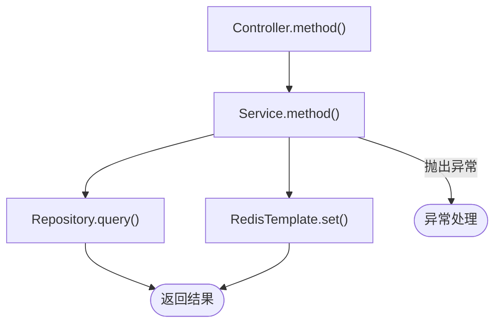
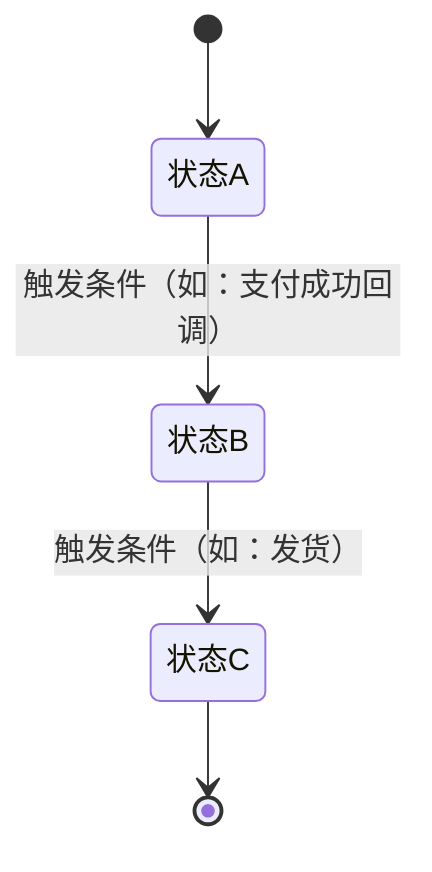

# code-reading Reference

> SKILL.md 的文档模板和输出格式。
> 在 Step 3 按需加载，不在 SKILL.md 启动时注入。

---

## 文档模板

````markdown
# <功能名> 代码地图

> 生成日期：<YYYY-MM-DD>
> 入口：<入口类.方法() 或 dev-doc路径>
> 入口模式：<功能描述 / dev-doc / 入口代码>

---

## 一、概览

**功能描述：** [一句话说明这段代码做什么]

**涉及模块：**
- Controller：[类名]
- Service：[类名]
- Repository/Mapper：[类名]
- 外部依赖：[Redis / 第三方 SDK / MQ / 无]

**入口方法：** `完整包名.类名.方法名()`

---

## 二、入口与调用链



> 节点格式：`类名.方法名()`，不含包名
> 异常路径用 `|"描述"|` 边标签标注

---

## 三、状态变化

### 业务状态机

> 仅在代码中发现明确状态跳转（setStatus / 枚举赋值）时生成，否则删除本节



### 关键变量追踪

> 仅在变量被 3 处以上读写时记录，否则删除本节

| 变量名 | 初始值/来源 | 修改点（文件:行号） | 最终用途 |
|--------|------------|-------------------|---------|
| | | | |

---

## 四、主要代码位置

| 类/方法 | 文件路径:行号 | 说明（一句话） |
|---------|-------------|--------------|
| | | |

---

## 五、关键注意点

- **隐含约束**：[如：该方法必须在 @Transactional 内调用，否则 Redis 操作与 DB 不一致]
- **并发风险**：[如：Redis SETNX 防重复发送，注意 TTL 与业务超时的关系]
- **边界条件**：[如：入参 phone 为 null 时直接返回，不会走验证逻辑]
- **魔法数字**：[如：验证码 TTL 硬编码 300，单位为秒，等于 5 分钟]

> 无相关内容则删除对应子项，不留空占位

---

## 六、方案 vs 实现对照（仅 dev-doc 模式生成）

> 对照 dev-doc「二、技术方案」和「六、代码变更清单」，逐条确认代码与设计的一致性

| dev-doc 方案描述 | 代码实际实现 | 一致性 |
|----------------|------------|--------|
| 新增 `LoginStrategy` 接口 | `LoginStrategy.java` 已创建，接口定义与文档一致 | ✅ |
| `AuthServiceImpl` 改为策略分发 | 用 `Map<LoginType, LoginStrategy>` 查找分发 | ✅ |
| Redis TTL 5 分钟 | `expire(key, 300, TimeUnit.SECONDS)` | ✅ |
| 新增 `/api/v1/auth/sms-login` 接口 | 已在 `AuthController` 中找到对应方法 | ✅ |

> ✅ = 与文档一致；⚠️ = 存在偏差或未找到对应代码，Review 时重点关注
````

---

## 完成输出格式

```
✅ 代码地图已生成：docs/<日期>/<功能名>.md

可以开始 Review 了。
如需 AI 审查，运行：/requesting-code-review
```
