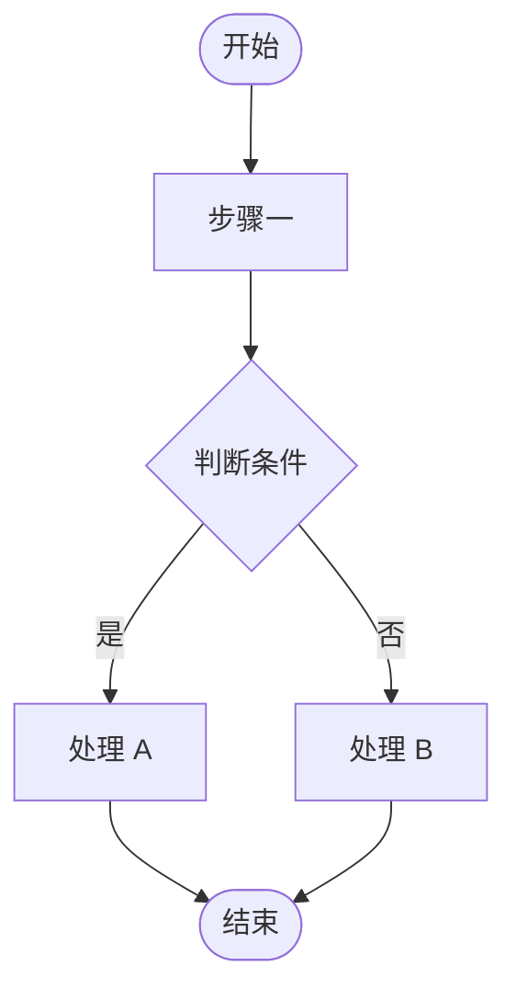

# dev-doc Reference

> SKILL.md 的详细规范——文档模板、信息槽位、输出格式。
> 此文件在 Step 3-6 按需加载，不在 SKILL.md 启动时注入。

---

## Step 3 查漏槽位

> 使用方式：先执行 [../_shared/interaction-policy.md](../_shared/interaction-policy.md)。下表是信息槽位，不是逐条必问题卷；能从用户输入、代码、接口、现有文档中确定就直接填。只有“何时必须问”命中的阻塞项才问用户。

| 任务类型 | 槽位 | 可从哪里推断 | 何时必须问 |
|----------|------|--------------|------------|
| 简单任务 | 问题/目标、实现方向 | 任务名、当前文件、diff、相邻代码 | 目标或改动对象完全不清楚 |
| 新功能 | 背景、目标范围、技术方案、数据/接口变化、相关类/接口 | 需求描述、Controller/Service、接口文档、现有模块结构 | 状态/权限/数据归属/API 契约会影响方案 |
| Bug 修复 | 现象、根因证据、影响范围、修复边界、回归风险 | 报错、日志、堆栈、测试现象、最近改动 | 无法复现或根因没有证据却要生成修复 Todo |
| 重构/性能 | 动机、目标指标、兼容性、验证方式、灰度/回滚 | 现有代码重复点、慢查询/日志、性能指标、调用方 | 兼容性或性能目标不明确 |
| API 联调 | 对方服务、联调环境、接口契约、异常降级、上线节奏 | Swagger/Apifox/PDF、现有 client、配置、Mock | 请求/响应签名、鉴权、超时重试策略不明确 |
| 配置变更 | 配置项、影响范围、变更方式、回滚方案、验证方式 | yml/env/Nacos/Apollo、配置读取代码、部署文档 | 影响生产行为、需要重启、回滚方式不明确 |

---

## 文档模板

````markdown
# $task 开发文档

> 日期：<YYYY-MM-DD>
> 任务类型：<新功能 / Bug 修复 / 重构 / 性能优化>
> 复杂度：<简单 / 中等 / 复杂>
> 状态：草稿
> 关联分支/路径：<Git: branch 名 | SVN: 路径如 trunk / branches/feature-xxx>
> 关联版本：<Git: commit hash | SVN: revision 号如 r1234 | 暂无>

---

## 一、需求说明

### 背景
[需求来源、触发原因、解决的问题]

### 目标
- [ ] [明确的目标 1]
- [ ] [明确的目标 2]

### 范围
- ✅ 包含：[本次涉及的功能/模块]
- ❌ 不包含：[明确排除的内容，防止范围蔓延]

### 判断依据、明确假设与待确认

| 类型 | 内容 | 依据 | 处理口径 |
|------|------|------|----------|
| 事实 | [已由代码/文档/用户明确的信息] | [文件/接口/用户原话] | [直接采用] |
| 假设 | [低风险未知的默认口径] | [路径/命名/相邻实现] | [继续推进，后续可调整] |
| 需求冲突 | [用户说法与现有逻辑的冲突] | [代码/字典/状态机证据] | [建议口径；阻塞时先确认] |
| 阻塞问题 | [不确认就不能编码的点] | [缺失证据] | [先问用户，不生成执行提示] |
| 未确认项 | [非阻塞待确认] | [暂缺] | [不影响当前方案] |

---

## 二、技术方案

### 方案概述
[一句话描述整体技术思路]

### 核心设计
[关键设计决策：数据结构、算法、架构选择及原因]

### AI 执行口径

> 写给后续执行代码的 AI / 开发者：必须具体到可照做，避免"理解后自行发挥"。

- **前置条件**：[执行前必须确认的配置、表结构、接口契约、依赖服务]
- **执行顺序**：[先改什么，再改什么；跨模块时说明顺序原因]
- **验收标准**：[做到什么算完成，最好能对应命令、接口响应、页面/日志/数据结果]
- **禁止改动**：[明确不能碰的文件、接口签名、历史逻辑或数据结构]

### 最小影响分析（开闭原则）
- **新增内容**：[新增的类 / 方法 / 接口]
- **不变内容**：[明确列出不会被修改的现有代码]
- **必须修改**：[如有，说明原因及为何无法用扩展替代]

---

## 三、API 设计

> 仅当新增接口、或修改既有接口的参数/返回结构时保留本节；只是调用已有接口且签名无变化 → 删除本节

| Method | URL | 说明 |
|--------|-----|------|
| GET / POST / PUT / DELETE | /api/v1/xxx | |

**Request：**
```json
{}
```

**Response：**
```json
{}
```

---

## 四、数据库变更

> 如不涉及 DB 变更，删除本节

- **DDL 变更**：[新增表 / 加字段 / 加索引]
- **数据迁移**：[是否需要迁移脚本，估计影响行数]
- **回滚 SQL**：[如何回滚]

```sql
-- DDL
```

---

## 五、缓存策略

> 如不涉及缓存，删除本节

- **缓存 Key**：[格式与命名规范]
- **TTL**：[过期时间]
- **失效策略**：[主动失效 / 被动过期]
- **击穿/雪崩防护**：[如何防护]

---

## 六、代码变更清单

| 文件路径 | 变更类型 | 说明 |
|----------|----------|------|
| | 新增 / 修改 / 删除 | |

> 每一行都要能指导执行：说明列必须写清"这个文件承担什么职责、改到什么程度"。修改类条目还必须写明为何无法用扩展替代。

---

## 七、流程图



> 根据实际业务流程替换占位节点。复杂任务可用 sequenceDiagram（时序图）

---

## 八、测试要点

### 验收标准
- [ ] [可通过命令/接口/日志/数据核对验证的完成标准]

### 单元测试
- [ ] [关键方法的单元测试覆盖]

### 集成测试
- [ ] [接口级别的集成测试]

### 边界与异常
- [ ] 入参为 null / 空字符串 / 超长
- [ ] 并发场景（如涉及）
- [ ] 异常分支（DB 失败、网络超时、第三方服务异常）

---

## 九、风险与注意事项

| 风险点 | 影响等级 | 应对措施 |
|--------|----------|----------|
| | 高 / 中 / 低 | |

---

## 十、上线计划

> 简单/中等任务只保留前两项；复杂任务才需要灰度策略和监控指标

- **依赖项**：[DB 变更 / 配置变更 / 第三方服务]
- **回滚方案**：[出问题如何快速回退]
- **灰度策略**：[复杂任务填写：如何分批 / 用户白名单 / 按比例]
- **监控指标**：[复杂任务填写：上线后看哪些指标]

---

## 十一、实现 Todo

> 把方案拆成可执行任务，编码时直接对照打勾。每条 Todo 使用"动词 + 对象 + 结果"格式，必要时带文件路径；不要写"完善逻辑"这种无法验收的句子。

- [ ] [在 <文件路径> 新增/修改 <类/方法>，完成 <可观察结果>]
- [ ] [补充 <测试文件/用例>，覆盖 <正常/异常/边界场景>]
- [ ] [运行 <验证命令>，确认 <预期输出/结果>]

---

## 十二、代码评审关注点

> 为 Code Review 阶段准备，基于本次变更填写

- **重点检查**：[最容易出错的代码路径、边界条件]
- **回归风险**：[改动可能波及的已有功能]
- **不要改的**：[明确不应该被修改的文件/方法/接口]

---

## 十三、Apifox 接口规范

> 仅当新增接口、或修改既有接口的参数/返回结构时保留本节，否则删除（调用已有接口且签名无变化不算接口变更）。
> 以下 YAML 可直接复制，在 Apifox 中通过「导入 → OpenAPI / Swagger」粘贴导入。

```yaml
openapi: "3.0.3"
info:
  title: "[任务名称] API"
  description: "[需求背景一句话]"
  version: "1.0.0"
servers:
  - url: "http://localhost:8080"
    description: "本地开发"
tags:
  - name: "[模块名]"
    description: "[功能描述]"
paths:
  /api/v1/[resource]:
    post:                          # 按实际方法替换（get/post/put/delete/patch）
      tags: ["[模块名]"]
      summary: "[接口一句话描述]"
      operationId: "[camelCase唯一ID]"
      requestBody:
        required: true
        content:
          application/json:
            schema:
              type: object
              required:
                - field1            # 必填字段列表
              properties:
                field1:
                  type: string
                  description: "[字段说明]"
                  example: "示例值"
                field2:
                  type: integer
                  description: "[字段说明]"
                  example: 1
      responses:
        "200":
          description: "成功"
          content:
            application/json:
              schema:
                $ref: "#/components/schemas/CommonResponse"
        "400":
          description: "参数错误"
        "401":
          description: "未登录"
        "500":
          description: "服务器错误"
components:
  schemas:
    CommonResponse:
      type: object
      properties:
        code:
          type: integer
          description: "状态码，0 表示成功"
          example: 0
        data:
          description: "业务数据"
        message:
          type: string
          description: "提示信息"
          example: "success"
```

> 填写指引：
> - `paths` 下每个路径对应一个接口，多接口直接并列
> - `operationId` 建议与 Controller 方法名一致，方便 Apifox 生成代码
> - 字段类型：`string` / `integer` / `number` / `boolean` / `array` / `object`
> - 数组示例：`type: array` + `items: { type: string }`
> - 引用公共响应体：`$ref: "#/components/schemas/CommonResponse"`
````

---

## 完成后输出格式

```
✅ 文档已生成：docs/<日期>/<任务名>.md

📌 关键决策：
1. <一句话>
2. <一句话>
3. <一句话>

🤖 交给 Claude/Cursor 执行（直接粘贴）：
"参考 docs/<日期>/<任务名>.md 实现技术方案。
先阅读「二、技术方案 / AI 执行口径」，确认前置条件、执行顺序、验收标准和禁止改动。
按「六、代码变更清单」逐项执行。
修改类条目先确认「最小影响分析」中的原因再动手。
按「十一、实现 Todo」逐项完成，每完成一项运行对应验证；若文档存在阻塞问题或阻塞型需求冲突，先输出确认问题，不得开始编码；低风险假设按文档记录执行。"

📁 纳入版本控制并确认变更范围：
- [ ] Git: `git add <新文件>` | SVN: `svn add <新文件>`
- [ ] 查看完整变更：`git diff` / `svn diff`

🧪 先验证（没有绿灯不进 Code Review）：
- [ ] <验证命令>（Maven: `mvn test` / Gradle: `./gradlew test` / Node: `npm test`）
- [ ] 测试全绿 → 继续；有失败 → 先修复再验证

🤖 AI 代码审查（修复后再继续）：
- [ ] Git: `/requesting-code-review` | SVN: `svn diff > /tmp/changes.patch` 后让 Claude 读取审查
- [ ] 按 Critical / Important / Minor 分级处理，修复后重跑测试确认全绿

👁 生成代码地图，自己 Review：
- [ ] `/code-reading docs/<日期>/<任务名>.md`（利用 dev-doc 生成调用链 + 状态机 + 关键位置）
- [ ] 对照地图检查业务逻辑、事务边界、关键注意点
- [ ] /chinese-code-review 整理评论话术（如有问题）

🏁 收尾（提交/合并后，让状态全员可见）：
- [ ] 看板里点状态标签只存浏览器本地；要让团队都看到，直接对 Claude 说：
      "把 project-html/data/changes.js 中标题为「<任务名>」的记录 status 改为 \"已完成\"，改完跑 node --check"
```

---
## HTML 看板模板

看板模板已抽取为独立资产目录：[assets/board/](assets/board/)

```
assets/board/
  index.html               外壳（优先加载本地 mermaid，CDN 兜底）
  css/board.css            样式（纸面编辑部风格）
  js/board.js              渲染逻辑（含 BOARD_VERSION 版本号；两级树 / 浏览索引 / 接口索引 / Bug 视图 / 阅读视图 / 业务流视图 / 变更日志）
  js/vendor/mermaid.min.js 本地 vendor（~3MB，内网可用；复制必须走 bash cp，禁止 Read+Write）
  build.js                 构建脚本（Node，无依赖）：生成自包含单页 pages/<slug>.html + docs/INDEX.md + 首次历史归档；清空 pages/ 前会比对 data/changes.js 记录数，疑似被误覆盖时中止（哨兵，BOARD_FORCE_BUILD=1 可强制跳过）
  data/changes.js          数据文件（占位符版本，首次创建看板时替换占位数据后写入）
```

**外壳复制时记得带上 `build.js`**（它也是字节一致的外壳文件）：`cp "$src/build.js" project-html/build.js`。

使用方式见 SKILL.md Step 5.5：用 `test -f` 确定性判断看板是否存在（不靠模型读 Read 结果猜）；不存在时 bash cp 复制外壳 + 填充数据；已存在时先备份 `data/changes.js.bak`，再检查 `BOARD_VERSION` 升级外壳、按 `docPath` 查重后追加/更新 `data/changes.js`，最后 `node --check` + 记录数回归校验（数变小自动回滚）。

**维护提示**：
- `assets/board/` 的外壳文件（index.html / css / js / vendor）与仓库根 `project-html/` 对应文件保持完全一致，仅 `data/changes.js` 不同（模板为占位符，实际看板为真实数据）。修改看板行为时两处同步更新，**外壳有行为变化时 `BOARD_VERSION` +1**，并运行 `scripts/check-board-sync.sh` 校验。
- `/bug-fix` 与 `/code-reading` skill 复用同一资产目录（安装后路径 `../dev-doc/assets/board/`）。
- 数据追加依赖 `data/changes.js` 中的两个标记行（`// ─── 在此行上方追加新记录 ───` 与 `// ─── 在此行上方追加变更日志 ───`），不可删除。
