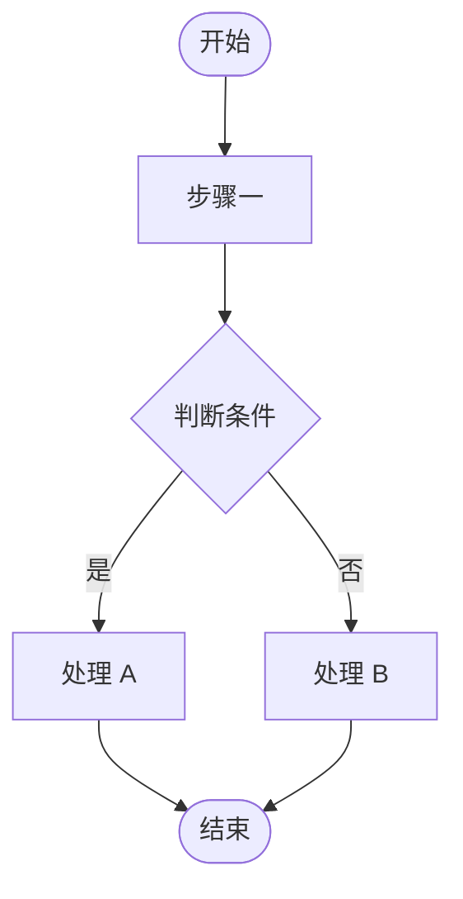

# Yan Dev Doc Standard Template

## 文档模板

````markdown
# $task 开发文档

> 日期：<YYYY-MM-DD>
> 任务类型：<新功能 / Bug 修复 / 重构 / 性能优化>
> 复杂度：<简单 / 中等 / 复杂>
> 状态：草稿
> 关联分支/路径：<Git: branch 名 | SVN: 路径如 trunk / branches/feature-xxx>
> 关联版本：<Git: commit hash | SVN: revision 号如 r1234 | 暂无>
> 前置文档：<Standard 填“无”；IncrementalRevision 单篇填 [文档名称](仓库相对路径) — 承接：<主题/约束范围>；多篇删除本行并使用下方清单>
>
> **前置文档（全部必读；仅多篇时保留，不得只列最近一篇）：**
> - [文档名称 A](仓库相对路径) — 承接：<业务背景/模块/接口/禁止改动/验证口径>
> - [文档名称 B](仓库相对路径) — 承接：<业务背景/模块/接口/禁止改动/验证口径>
> 文档模式：<Standard | IncrementalRevision>

---

## 一、需求说明

### 背景
[需求来源、触发原因、解决的问题]

> `IncrementalRevision`：这里只写相对前置文档的增量原因与边界，未变化背景由前置文档承接。存在多篇时必须逐篇读取“前置文档（全部必读）”清单；若口径冲突，在“判断依据、明确假设与待确认”中记录，不按文档日期静默覆盖。

### 目标
- [ ] [明确的目标 1]
- [ ] [明确的目标 2]

### 范围
- ✅ 包含：[本次涉及的功能/模块]
- ❌ 不包含：[明确排除的内容，防止范围蔓延]

### 判断依据、明确假设与待确认

| 类型 | 内容 | 依据 | 处理口径 |
|------|------|------|----------|
| 事实 | [已由代码/文档/用户明确的信息] | [文件/接口/用户原话] | [直接采用] |
| 假设 | [低风险未知的默认口径] | [路径/命名/相邻实现] | [继续推进，后续可调整] |
| 需求冲突 | [用户说法与现有逻辑的冲突] | [代码/字典/状态机证据] | [建议口径；阻塞时先确认] |
| 需求冲突（已裁决） | 旧口径：[已被否决的方案]；最终口径：[本轮确认方案]；实现禁令：[不得恢复的旧行为] | [用户本轮明确否决/选择 + 前置文档或代码证据] | conflicts(status=resolved)；不阻塞，只按最终口径实施 |
| 阻塞问题 | [不确认就不能编码的点] | [缺失证据] | [先问用户，不生成执行提示] |
| 未确认项 | [非阻塞待确认] | [暂缺] | [不影响当前方案] |

---

## 二、技术方案

### 方案概述
[一句话描述整体技术思路]

### 核心设计
[关键设计决策：数据结构、算法、架构选择及原因]

### AI 执行口径

> 写给后续执行代码的 AI / 开发者：必须具体到可照做，避免"理解后自行发挥"。

- **前置条件**：[执行前必须确认的配置、表结构、接口契约、依赖服务；IncrementalRevision 有多篇前置文档时，逐篇列出文档名称、链接及其承接约束，并要求全部读完后再实施]
- **执行顺序**：[先改什么，再改什么；跨模块时说明顺序原因]
- **验收标准**：[做到什么算完成，最好能对应命令、接口响应、页面/日志/数据结果]
- **禁止改动**：[明确不能碰的文件、接口签名、历史逻辑或数据结构]

### 最小影响分析（开闭原则）
- **新增内容**：[新增的类 / 方法 / 接口]
- **不变内容**：[明确列出不会被修改的现有代码]
- **必须修改**：[如有，说明原因及为何无法用扩展替代]

### 接口影响分类（涉及接口时保留）

| Method + URL | 分类 | 契约是否变化 | 依据 | 进入 OpenAPI / 看板 `apis[]` | 行为与兼容性说明 |
|--------------|------|----------------|------|-------------------------------|------------------|
| [接口] | 新增 / 契约变更 / 行为变更 / 仅调用 | 是 / 否 | [Controller/DTO/接口文档/用户明确约束] | 是 / 否 | [校验、路由、过滤、状态判断、副作用及调用方影响] |

> “原参数不动”不能单独证明契约不变，还要核对响应结构、状态码/错误码和鉴权输入。行为变更接口不进入 OpenAPI 和看板 `apis[]`；混合任务只登记新增/契约变更接口。

---

## 三、API 设计

> 仅当存在新增接口或契约变更时保留本节。纯行为变更（契约不变的校验/路由/状态收紧）或仅调用已有接口不进入本节；混合任务只列新增/契约变更接口

| Method | URL | 说明 |
|--------|-----|------|
| GET / POST / PUT / DELETE | /api/v1/xxx | |

**Request：**
```json
{}
```

**Response：**
```json
{}
```

---

## 四、数据库变更（DBA 申请草案）

> 如不涉及 DB 变更，删除本节。涉及新增库/表/字段/索引/约束时，本节只供用户确认和 DBA 审核；yan-dev-doc 与后续 AI 不得执行 DDL 或数据修复。

- **用户确认**：<已明确同意生成变更申请 / 待确认；待确认时作为 blocker>
- **DBA 审批状态**：<待申请 / 审批中 / 已批准；执行人必须是授权人员>
- **建议结构变更**：[新增表 / 加字段 / 加索引；仅为方案]
- **影响评估**：[锁表、容量、兼容性、预计影响行数]
- **数据迁移建议**：[是否需要；不得由本 skill 执行]
- **建议回滚方案**：[如何回滚；由 DBA 审核]
- **只读验证 SQL**：[执行前后用于核对结构/数据的 SELECT / information_schema 查询]

```sql
-- 建议 DDL，仅供 DBA 审核；不得由 yan-dev-doc 或执行 AI 直接运行
```

---

## 五、缓存策略

> 如不涉及缓存，删除本节

- **缓存 Key**：[格式与命名规范]
- **TTL**：[过期时间]
- **失效策略**：[主动失效 / 被动过期]
- **击穿/雪崩防护**：[如何防护]

---

## 六、代码变更清单

| 文件路径 | 变更类型 | 说明 |
|----------|----------|------|
| | 新增 / 修改 / 删除 | |

> 每一行都要能指导执行：说明列必须写清"这个文件承担什么职责、改到什么程度"。修改类条目还必须写明为何无法用扩展替代。

---

## 七、流程图



> 根据实际业务流程替换占位节点。复杂任务可用 sequenceDiagram（时序图）

---

## 八、测试要点

### 验收标准
- [ ] [可通过命令/接口/日志/数据核对验证的完成标准]

### 单元测试
- [ ] [关键方法的单元测试覆盖]
- TestDependencyClass：`Hermetic`；不得依赖真实网络、外部账号或生产凭据

### 集成测试
- [ ] [接口级别的集成测试]
- TestDependencyClass：`ServiceBacked / LiveExternal`；ServiceBacked 写明受控服务方案，LiveExternal 写明独立 profile/tag/job 和凭据边界

### 边界与异常
- [ ] 入参为 null / 空字符串 / 超长
- [ ] 并发场景（如涉及）
- [ ] 异常分支（DB 失败、网络超时、第三方服务异常）

---

## 九、风险与注意事项

| 风险点 | 影响等级 | 应对措施 |
|--------|----------|----------|
| | 高 / 中 / 低 | |

---

## 十、上线计划

> 简单/中等任务只保留前两项；复杂任务才需要灰度策略和监控指标

- **依赖项**：[DB 变更 / 配置变更 / 第三方服务]
- **回滚方案**：[出问题如何快速回退]
- **灰度策略**：[复杂任务填写：如何分批 / 用户白名单 / 按比例]
- **监控指标**：[复杂任务填写：上线后看哪些指标]

---

## 十一、实现 Todo

> 把方案拆成可执行任务，编码时直接对照打勾。每条 Todo 使用"动词 + 对象 + 结果"格式，必要时带文件路径；不要写"完善逻辑"这种无法验收的句子。

- [ ] [在 <文件路径> 新增/修改 <类/方法>，完成 <可观察结果>]
- [ ] [补充 <测试文件/用例>，覆盖 <正常/异常/边界场景>]
- [ ] [运行 <验证命令>，确认 <预期输出/结果>]

---

## 十二、代码评审关注点

> 为 Code Review 阶段准备，基于本次变更填写

- **重点检查**：[最容易出错的代码路径、边界条件]
- **回归风险**：[改动可能波及的已有功能]
- **不要改的**：[明确不应该被修改的文件/方法/接口]

---

## 十三、Apifox 接口规范

> 仅当新增接口、或修改既有接口的参数/返回结构时保留本节，否则删除（调用已有接口且签名无变化不算接口变更）。
> 完整 OpenAPI YAML 单独保存，本文档只记录导入入口、接口索引和维护规则。

- **OpenAPI 文件**：`docs/apifox/<YYYY-MM-DD>/<任务名>.openapi.yaml`
- **Apifox 导入**：Apifox → 导入 → OpenAPI / Swagger → 选择该 YAML 文件，或粘贴文件内容
- **接口索引**：`docs/apifox/INDEX.md`
- **维护规则**：后续新增接口、调整请求参数、调整响应结构或变更路径/方法时，优先更新上述 YAML 文件；不要只改本文档的接口表
- **总索引说明**：`docs/INDEX.md` 由 `node project-html/build.js` 自动生成，不手工编辑；它会从看板 `apiSpecPath` 生成 OpenAPI 链接列

| Method | URL | operationId | 说明 | OpenAPI 文件 |
|--------|-----|-------------|------|--------------|
| GET / POST / PUT / DELETE | /api/v1/xxx | camelCaseUniqueId | | `docs/apifox/<YYYY-MM-DD>/<任务名>.openapi.yaml` |

````

---
